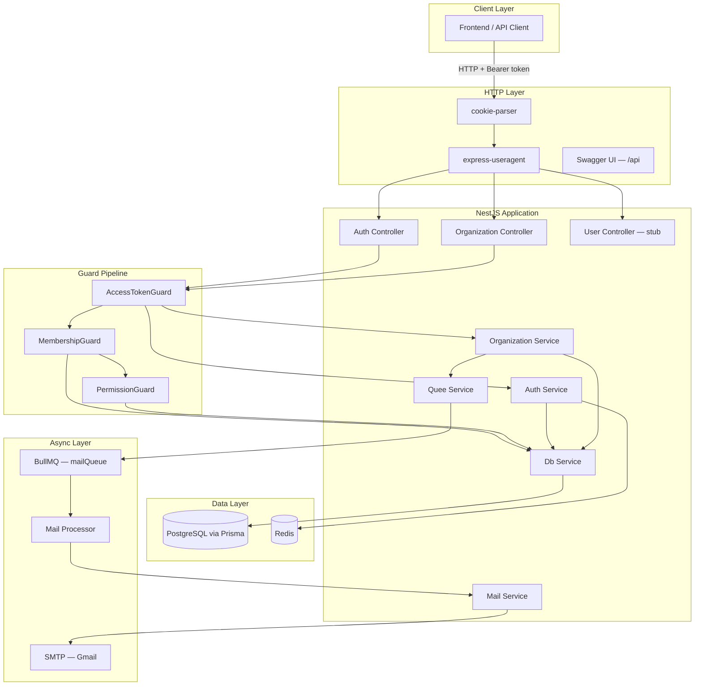
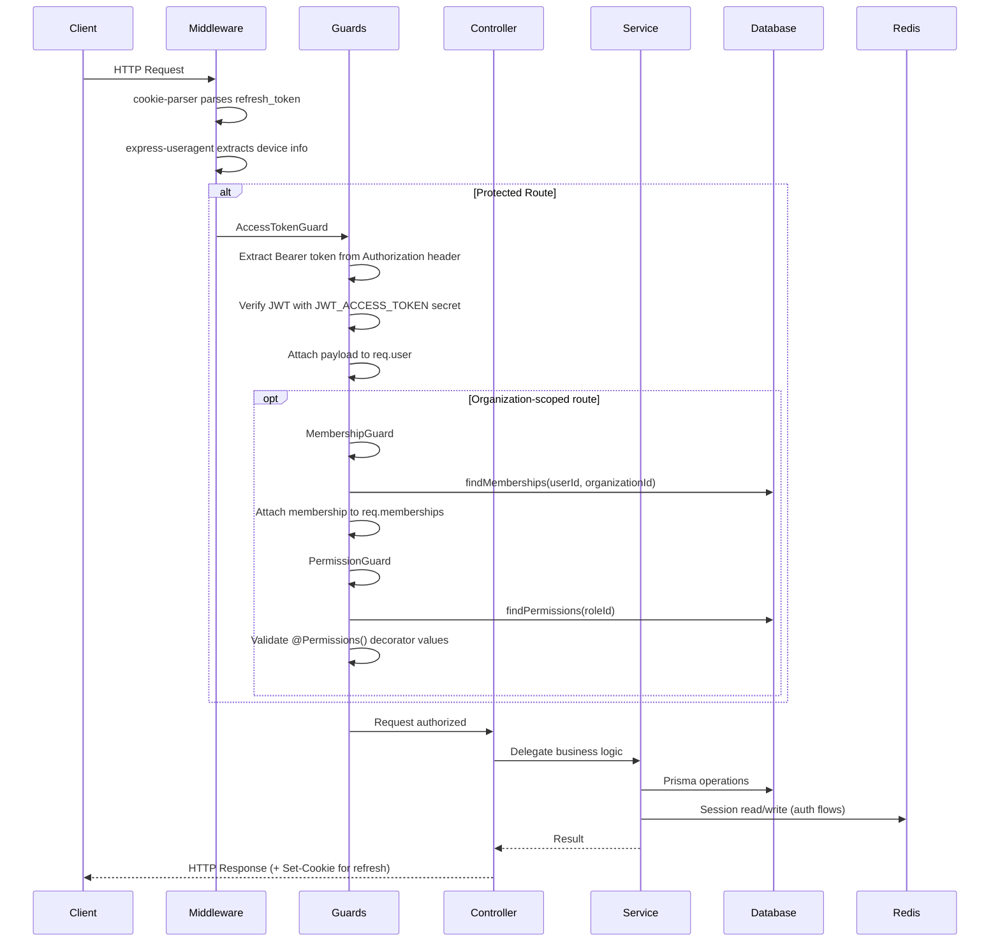
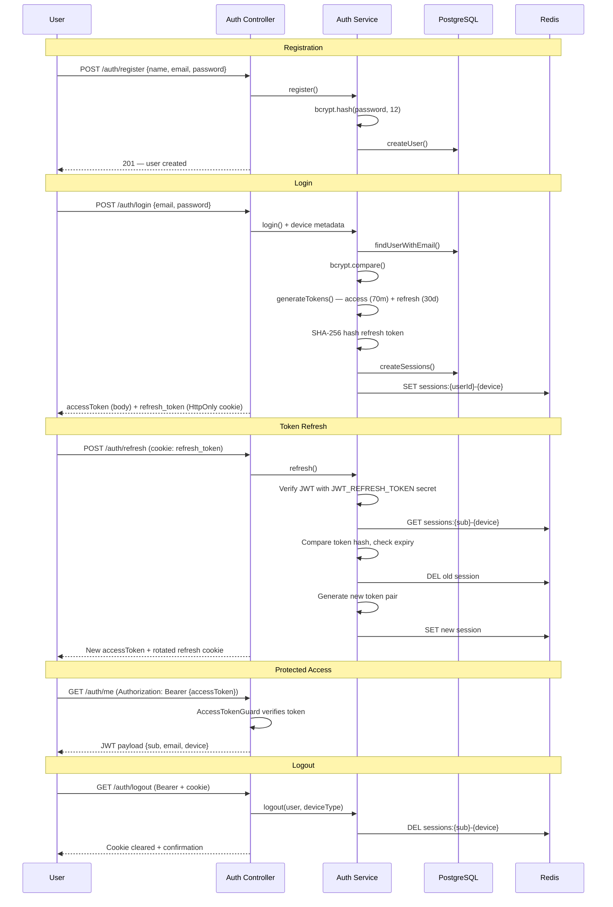
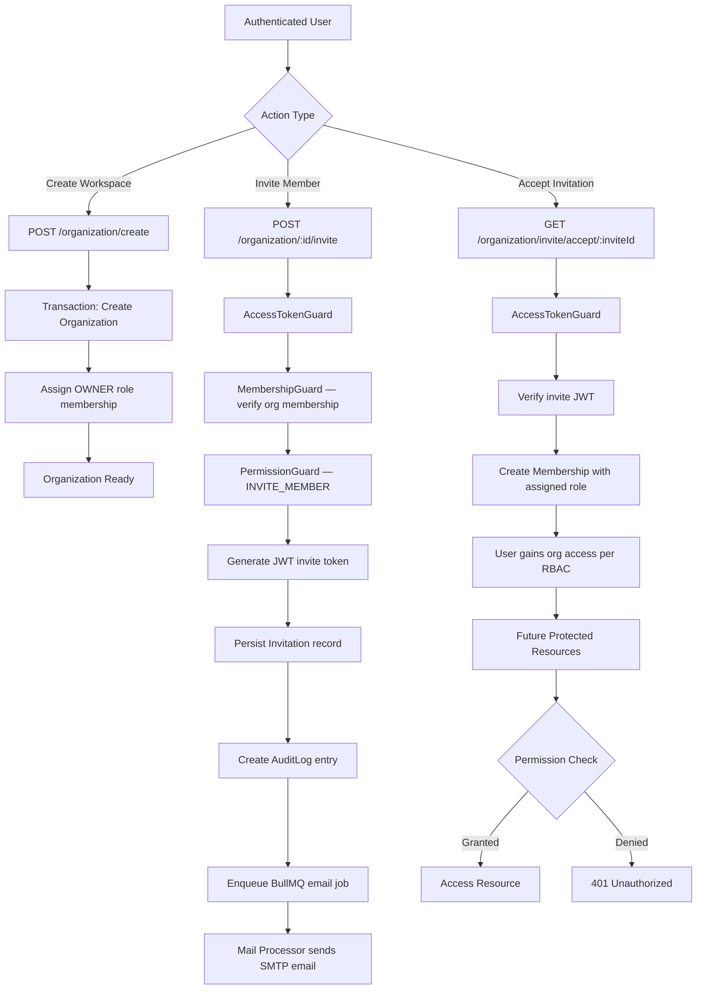
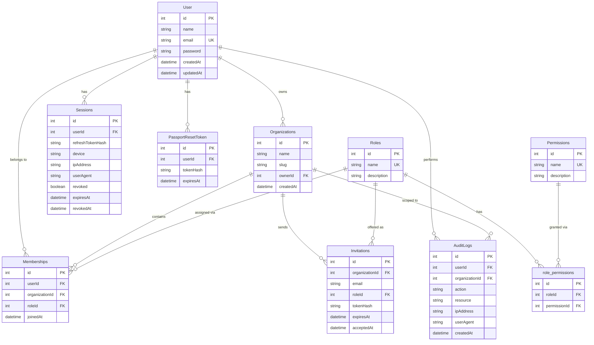
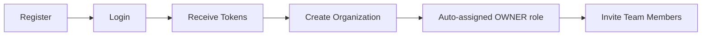
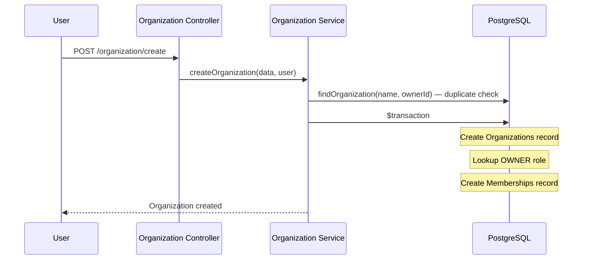
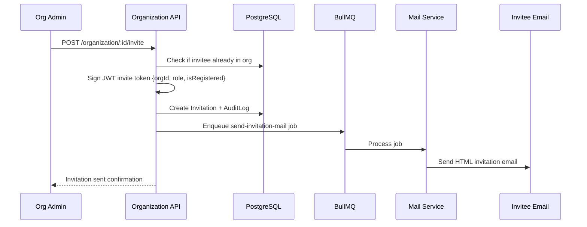
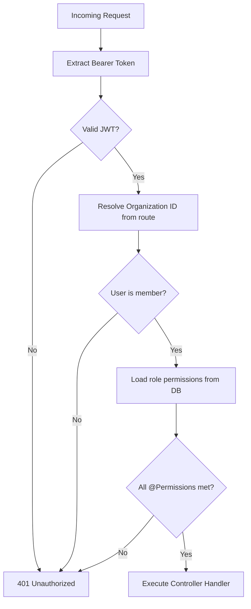
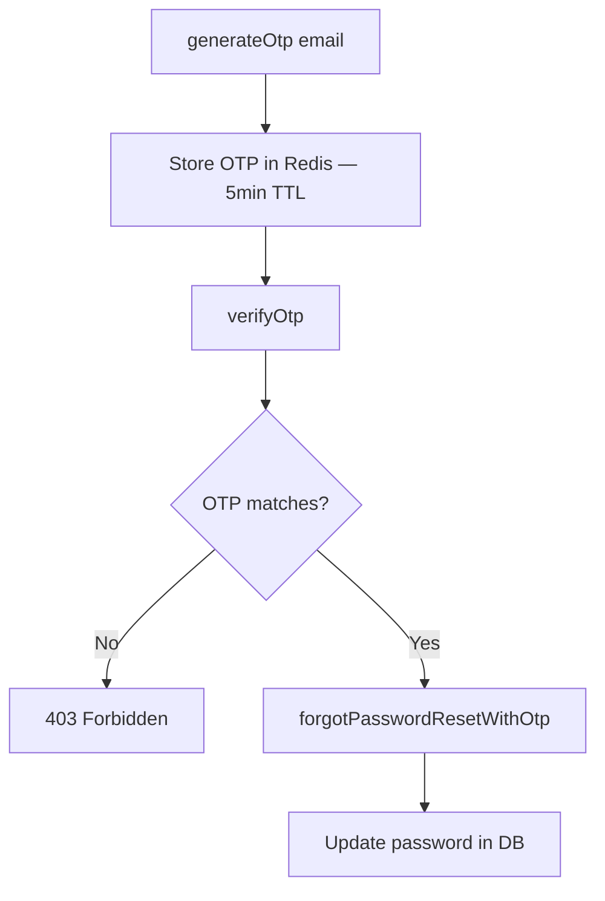

# Team Access Control API

A production-oriented **NestJS skeleton backend** for multi-tenant, team-collaborative SaaS applications. This project provides the identity, access management, and organization primitives that underpin products like **Notion**, **Trello**, **Jira**, **Linear**, and **Slack** — user authentication, organization workspaces, role-based permissions, member invitations, session management, and audit logging.

> **Interactive API documentation:** [http://localhost:3000/api](http://localhost:3000/api) (Swagger UI)

---

## Table of Contents

1. [Project Overview](#1-project-overview)
2. [Tech Stack](#2-tech-stack)
3. [System Architecture](#3-system-architecture)
4. [Folder Structure](#4-folder-structure)
5. [Database Design](#5-database-design)
6. [API Documentation](#6-api-documentation)
7. [Authorization System](#7-authorization-system)
8. [Core Backend Flows](#8-core-backend-flows)
9. [Error Handling Strategy](#9-error-handling-strategy)
10. [Security Practices](#10-security-practices)
11. [Local Development Setup](#11-local-development-setup)
12. [Environment Variables](#12-environment-variables)
13. [Deployment Guide](#13-deployment-guide)
14. [Future Improvements](#14-future-improvements)
15. [Engineering Decisions](#15-engineering-decisions)

---

## 1. Project Overview

### Problem Statement

Multi-tenant SaaS products require more than user login. Every collaborative application must answer:

- Who is this user?
- Which organization (workspace) are they operating in?
- What role do they hold within that organization?
- What actions are they permitted to perform?
- How are sessions managed across devices?
- How are team members onboarded securely?

Building these concerns from scratch in every product is expensive, error-prone, and difficult to scale. This API extracts those cross-cutting concerns into a dedicated, reusable backend foundation.

### Core Purpose

The **Team Access Control API** is an IAM-style (Identity and Access Management) backend that provides:

| Capability | Status |
|---|---|
| User registration & authentication | Implemented |
| JWT access + refresh token strategy | Implemented |
| Multi-device session management (PostgreSQL + Redis) | Implemented |
| Organization (workspace) creation | Implemented |
| Member invitation via email queue | Implemented |
| Role-based access control (RBAC) | Implemented |
| Audit logging for sensitive actions | Partial (invitation events) |
| Password reset / OTP flows | Service-layer only (no HTTP endpoints yet) |
| Dedicated user/roles/sessions modules | Stub / not yet built |

### Real-World Use Cases

- **Project management tools** (Trello, Jira): organizations as workspaces, roles controlling board/project access
- **Knowledge bases** (Notion): workspace membership with viewer/editor/admin tiers
- **Team chat** (Slack): organization-scoped channels with permission-gated administration
- **Developer platforms** (GitHub orgs): invite-based onboarding with role assignment
- **Internal admin panels**: audit trails for compliance-sensitive operations

### Why This Architecture Scales

- **Modular NestJS design** — each domain (auth, organization, mail, queue) is an isolated module with clear boundaries, enabling independent evolution and eventual microservice extraction.
- **Dual-layer session storage** — PostgreSQL for durability, Redis for fast session lookup and token rotation validation.
- **Asynchronous email delivery** — BullMQ decouples invitation email sending from the HTTP request path.
- **Composable guard pipeline** — authentication, membership, and permission checks are layered and reusable across any future controller.
- **Seed-driven RBAC** — roles and permissions are data-driven, not hardcoded in application logic.

---

## 2. Tech Stack

| Technology | Version | Role | Rationale |
|---|---|---|---|
| **NestJS** | 11.x | Application framework | Enforces modular architecture, dependency injection, and guard/interceptor patterns suitable for enterprise APIs |
| **TypeScript** | 5.7 | Language | Static typing across DTOs, services, and Prisma models reduces runtime errors |
| **PostgreSQL** | 16 | Primary database | ACID compliance for users, memberships, roles, sessions, and audit logs |
| **Prisma** | 7.8 | ORM | Type-safe queries, migration management, and schema-as-code |
| **Redis** | 7.2 | Session cache | Sub-millisecond session lookups for refresh token rotation |
| **BullMQ** | 5.x | Job queue | Reliable async processing for transactional emails |
| **JWT** (`@nestjs/jwt`) | 11.x | Authentication | Stateless access tokens; signed refresh and invitation tokens |
| **bcryptjs** | 3.x | Password hashing | Cost-factor 12 hashing at registration |
| **class-validator** | 0.15 | Input validation | DTO-level request validation (requires global `ValidationPipe` — see [§9](#9-error-handling-strategy)) |
| **Swagger** (`@nestjs/swagger`) | 11.x | API documentation | Auto-generated, interactive docs at `/api` |
| **Nodemailer** | 9.x | Email transport | SMTP-based invitation email delivery |
| **cookie-parser** | 1.x | Cookie handling | HttpOnly refresh token transport |
| **express-useragent** | 2.x | Device detection | Session metadata (mobile/desktop, browser) |
| **Docker Compose** | 3.8 | Local infrastructure | PostgreSQL, Redis, pgAdmin, RedisInsight |
| **Jest** | 30.x | Testing | Unit and e2e test runner |
| **pnpm** | — | Package manager | Fast, disk-efficient dependency management |

### Not Currently Implemented

- CI/CD pipelines (no `.github/workflows`)
- Application Dockerfile (only infrastructure `docker-compose.yaml` exists)
- Rate limiting middleware
- Global CORS configuration
- Structured logging (Winston/Pino)
- APM / monitoring integrations

---

## 3. System Architecture

### High-Level System Architecture



### Request Lifecycle Flow



### Authentication Flow



### Team Access Control Flow



---

## 4. Folder Structure

```
team-access-control-api/
├── prisma/
│   ├── migrations/          # Versioned SQL migrations
│   ├── schema.prisma        # Database schema (source of truth)
│   └── seed.ts              # Roles, permissions, role_permissions seed data
├── src/
│   ├── auth/
│   │   ├── auth-dto/        # RegisterDTO, LoginDTO, forgotPasswordDTO
│   │   ├── guards/
│   │   │   ├── access-token/  # JWT Bearer token validation
│   │   │   ├── membership/    # Organization membership verification
│   │   │   └── permission/    # RBAC permission enforcement
│   │   ├── auth.controller.ts
│   │   ├── auth.service.ts
│   │   ├── auth.module.ts
│   │   └── auth,types.ts
│   ├── organization/
│   │   ├── organization-dto/
│   │   ├── organization.controller.ts
│   │   ├── organization.service.ts
│   │   └── organization.module.ts
│   ├── user/                # Stub module (controller empty, service empty)
│   ├── db/
│   │   ├── db.service.ts    # Centralized Prisma data access layer
│   │   └── db.module.ts
│   ├── prisma/
│   │   ├── prisma.service.ts  # PrismaClient with PG adapter
│   │   └── prisma.module.ts
│   ├── redis/
│   │   ├── redis.module.ts    # ioredis client provider
│   │   └── redis.constants.ts
│   ├── mail/
│   │   ├── mail.service.ts    # Nodemailer SMTP + HTML invite template
│   │   ├── quee.processor.ts  # BullMQ worker for email jobs
│   │   └── mail.module.ts
│   ├── quee/
│   │   ├── quee.service.ts    # Enqueue mail jobs
│   │   └── quee.module.ts
│   ├── permissions/
│   │   └── permissions.decorator.ts  # @Permissions() metadata decorator
│   ├── constants/
│   │   └── jobName.ts         # BullMQ job name constants
│   ├── generated/prisma/      # Auto-generated Prisma client (do not edit)
│   ├── app.module.ts          # Root module — wires all imports
│   └── main.ts                # Bootstrap, Swagger, middleware
├── test/
│   ├── app.e2e-spec.ts        # E2E smoke test
│   └── jest-e2e.json
├── docker-compose.yaml        # PostgreSQL, Redis, pgAdmin, RedisInsight
├── prisma.config.ts           # Prisma CLI configuration
├── package.json
└── README.md
```

### Module Responsibilities

| Module | Responsibility |
|---|---|
| `auth` | Registration, login, token rotation, session lifecycle, logout |
| `organization` | Workspace creation, member invitations, invitation acceptance |
| `user` | Placeholder — intended for user profile and management endpoints |
| `db` | Shared data access abstraction over Prisma (users, orgs, memberships, permissions, invitations, audit logs) |
| `prisma` | Database client initialization with `@prisma/adapter-pg` |
| `redis` | Injectable Redis client for session caching and OTP storage |
| `mail` | SMTP email delivery with HTML templates |
| `quee` | BullMQ job enqueueing for async email processing |
| `permissions` | `@Permissions()` decorator for declarative RBAC on routes |

---

## 5. Database Design

### Entity-Relationship Diagram



### Indexes & Constraints

| Table | Constraint | Type |
|---|---|---|
| `User.email` | Unique | Prevents duplicate accounts |
| `Roles.name` | Unique | Ensures canonical role names |
| `Permissions.name` | Unique | Ensures canonical permission names |
| `role_permissions(roleId, permissionId)` | Unique composite | Prevents duplicate role-permission mappings |
| All foreign keys | `ON DELETE RESTRICT` | Prevents orphaned records |

### Seeded Roles & Permissions

**Roles:** `OWNER`, `ADMIN`, `MEMBER`, `VIEWER`

**Permissions:**

| Category | Permissions |
|---|---|
| Organization | `CREATE_ORGANIZATION`, `UPDATE_ORGANIZATION`, `DELETE_ORGANIZATION`, `VIEW_ORGANIZATION` |
| Members | `INVITE_MEMBER`, `REMOVE_MEMBER`, `UPDATE_MEMBER_ROLE`, `VIEW_MEMBERS` |
| Projects | `CREATE_PROJECT`, `UPDATE_PROJECT`, `DELETE_PROJECT`, `VIEW_PROJECT` |
| Audit | `VIEW_AUDIT_LOGS` |

Role-permission mappings are defined in `prisma/seed.ts` and applied via `pnpm prisma db seed`.

---

## 6. API Documentation

> **Full interactive documentation with request/response schemas:** [http://localhost:3000/api](http://localhost:3000/api)

### Authentication

#### `POST /auth/register`

| | |
|---|---|
| **Purpose** | Register a new user account |
| **Auth** | None |
| **Body** | `{ "name": "string", "email": "string", "password": "string" }` |

**Response (201):**
```json
{
  "id": 1,
  "name": "Jane Doe",
  "email": "jane@example.com",
  "createdAt": "2026-07-12T00:00:00.000Z",
  "updatedAt": "2026-07-12T00:00:00.000Z"
}
```

**Possible errors:**
| Status | Condition |
|---|---|
| 200 (soft) | `{ "message": "User already registered." }` — duplicate email |
| 400 | Validation failure (when `ValidationPipe` is enabled) |

---

#### `POST /auth/login`

| | |
|---|---|
| **Purpose** | Authenticate user, issue access token and refresh cookie |
| **Auth** | None |
| **Body** | `{ "email": "string", "password": "string" }` |

**Response (200):**
```json
{
  "message": "Token assigned sucess nd user logged in success.",
  "accessToken": "eyJhbGciOiJIUzI1NiIs...",
  "sessions": {
    "id": 1,
    "userId": 1,
    "device": "desktop",
    "ipAddress": "::1",
    "userAgent": "Chrome",
    "expiresAt": "2026-08-11T00:00:00.000Z"
  }
}
```

**Set-Cookie:** `refresh_token` (HttpOnly, 30-day maxAge)

**Possible errors:**
| Status | Condition |
|---|---|
| 401 | Invalid email or password |

---

#### `POST /auth/refresh`

| | |
|---|---|
| **Purpose** | Rotate refresh token and issue new access token |
| **Auth** | `refresh_token` HttpOnly cookie |
| **Body** | None |

**Response (200):**
```json
{
  "message": "token rotation success..",
  "accessToken": "eyJhbGciOiJIUzI1NiIs..."
}
```

**Set-Cookie:** New `refresh_token` (rotated)

**Possible errors:**
| Status | Condition |
|---|---|
| 401 | No cookie, session not found, hash mismatch, or session expired |

---

#### `GET /auth/me`

| | |
|---|---|
| **Purpose** | Return current authenticated user's JWT payload |
| **Auth** | Bearer access token |
| **Headers** | `Authorization: Bearer {accessToken}` |

**Response (200):**
```json
{
  "sub": 1,
  "email": "jane@example.com",
  "device": "desktop",
  "iat": 1720000000,
  "exp": 1720004200
}
```

**Possible errors:**
| Status | Condition |
|---|---|
| 401 | Missing, invalid, or expired Bearer token |

---

#### `GET /auth/logout`

| | |
|---|---|
| **Purpose** | Logout current device — invalidate Redis session and clear cookie |
| **Auth** | Bearer access token |
| **Headers** | `Authorization: Bearer {accessToken}` |

**Response (200):**
```json
{
  "message": "logged out scuesfully"
}
```

---

### Organizations

#### `POST /organization/create`

| | |
|---|---|
| **Purpose** | Create a new organization; creator becomes OWNER |
| **Auth** | Bearer access token |
| **Body** | `{ "name": "string", "slug": "string" }` |

**Response (200):**
```json
{
  "message": "Organization and memberships Created Succesfully",
  "datas": {}
}
```

**Possible errors:**
| Status | Condition |
|---|---|
| 401 | Unauthenticated |
| 409 | Organization with same name already exists for this owner |

---

#### `POST /organization/:id/invite`

| | |
|---|---|
| **Purpose** | Invite a user to an organization by email |
| **Auth** | Bearer + Membership + `INVITE_MEMBER` permission |
| **Params** | `id` — organization ID (integer) |
| **Body** | `{ "email": "string", "role": "string" }` |

**Valid roles:** `OWNER`, `ADMIN`, `MEMBER`, `VIEWER` (must exist in database)

**Response (200):**
```json
{
  "message": "Invitation Sent Succesfully",
  "invitationCreated": { }
}
```

**Possible errors:**
| Status | Condition |
|---|---|
| 401 | Not authenticated, not a member, or lacks `INVITE_MEMBER` permission |
| 404 | Organization not found |
| 409 | User already a member of this organization |

---

#### `GET /organization/invite/accept/:inviteId`

| | |
|---|---|
| **Purpose** | Accept an organization invitation |
| **Auth** | Bearer access token |
| **Params** | `inviteId` — JWT invitation token (not numeric ID) |

**Response (200):**
```json
{
  "message": "Invitation accepted sucesfully.",
  "membershipCreated": {
    "id": 2,
    "userId": 3,
    "organizationId": 1,
    "roleId": 3,
    "joinedAt": "2026-07-12T10:00:00.000Z"
  }
}
```

**Possible errors:**
| Status | Condition |
|---|---|
| 401 | Invalid or expired invitation token |

---

### Application

#### `GET /`

| | |
|---|---|
| **Purpose** | Health/hello endpoint |
| **Auth** | None |
| **Response** | `"Hello World!"` |

---

### Not Yet Exposed via HTTP

The following exist in `AuthService` but have **no controller endpoints**:

| Method | Purpose |
|---|---|
| `forgotPasswordResetWithPassword()` | Change password with old password verification |
| `generateOtp()` | Generate 8-digit OTP stored in Redis (5-min TTL) |
| `verifyOtp()` | Verify OTP from Redis |
| `forgotPasswordResetWithOtp()` | Reset password after OTP verification |

---

## 7. Authorization System

### RBAC Model

```
User → Membership → Role → Permissions → Allowed Actions
```

A user does not hold permissions directly. Access is resolved through their **membership** in an organization, which assigns a **role**, which maps to a set of **permissions** via the `role_permissions` join table.

### Guard Pipeline

Guards execute in declaration order on the route:

```typescript
@Permissions("INVITE_MEMBER")
@UseGuards(AccessTokenGuard, MembershipGuard, PermissionGuard)
@Post(":id/invite")
```

| Guard | Responsibility | Attaches to Request |
|---|---|---|
| `AccessTokenGuard` | Validates `Authorization: Bearer` JWT | `req.user` → `{ sub, email, device }` |
| `MembershipGuard` | Verifies user belongs to `:id` organization | `req.memberships` → `{ membershipId, organizationId, roleId }` |
| `PermissionGuard` | Reads `@Permissions()` metadata, checks role permissions | — (throws if denied) |

### Permission Validation Logic

1. `PermissionGuard` uses NestJS `Reflector` to read the `@Permissions("INVITE_MEMBER")` metadata from the route handler.
2. It reads `req.memberships.roleId` set by `MembershipGuard`.
3. `DbService.findPermissions(roleId)` queries `role_permissions` joined with `permissions`.
4. The guard checks that **every** required permission exists in the user's role permission set (`.every()` — all must match).
5. If any permission is missing → `401 Unauthorized`.

### Decorator

```typescript
// src/permissions/permissions.decorator.ts
export const Permissions = (...permissions: string[]) =>
  SetMetadata(PERMISSION_KEY, permissions);
```

Usage on any controller method to declare required permissions declaratively.

### Role Permission Matrix (Seeded)

| Permission | OWNER | ADMIN | MEMBER | VIEWER |
|---|:---:|:---:|:---:|:---:|
| CREATE_ORGANIZATION | ✓ | | | |
| UPDATE_ORGANIZATION | ✓ | ✓ | | |
| DELETE_ORGANIZATION | ✓ | | | |
| VIEW_ORGANIZATION | ✓ | ✓ | ✓ | ✓ |
| INVITE_MEMBER | ✓ | ✓ | | |
| REMOVE_MEMBER | ✓ | ✓ | | |
| UPDATE_MEMBER_ROLE | ✓ | | | |
| VIEW_MEMBERS | ✓ | ✓ | ✓ | ✓ |
| CREATE_PROJECT | ✓ | ✓ | ✓ | |
| UPDATE_PROJECT | ✓ | ✓ | ✓ | |
| DELETE_PROJECT | ✓ | ✓ | | |
| VIEW_PROJECT | ✓ | ✓ | ✓ | ✓ |
| VIEW_AUDIT_LOGS | ✓ | | | |

---

## 8. Core Backend Flows

### User Onboarding Flow



### Organization Creation Flow



### Member Invitation Flow



### Role Assignment Flow

Roles are assigned at two points:

1. **Organization creation** — creator automatically receives `OWNER` role via transactional membership creation.
2. **Invitation acceptance** — the role specified in the invitation JWT is resolved to a `roleId` and a new `Memberships` record is created.

There is no dedicated "change member role" endpoint yet, though `UPDATE_MEMBER_ROLE` permission is seeded for future implementation.

### Permission Checking Flow



### Password Reset Flow (Service Layer Only)



> **Note:** These flows are implemented in `AuthService` but not yet wired to HTTP endpoints.

### Email Verification

Not implemented. The `User` model does not include an `isEmailVerified` field.

---

## 9. Error Handling Strategy

### Current Approach

The application relies on **NestJS built-in exception handling** with no custom global exception filters or interceptors.

| Exception Class | HTTP Status | Usage |
|---|---|---|
| `UnauthorizedException` | 401 | Invalid credentials, missing/expired tokens, failed permission checks |
| `ForbiddenException` | 403 | OTP verification failure |
| `NotFoundException` | 404 | User/org not found |
| `ConflictException` | 409 | Duplicate organization, user already in org |
| `InternalServerErrorException` | 500 | Password update failure, SMTP errors |

### Validation Errors

DTOs use `class-validator` decorators (`@IsEmail`, `@IsString`), but a **global `ValidationPipe` is not registered** in `main.ts`. Validation will not execute automatically until the following is added:

```typescript
app.useGlobalPipes(new ValidationPipe({ whitelist: true, forbidNonWhitelisted: true }));
```

### Error Response Format

NestJS default format:

```json
{
  "statusCode": 401,
  "message": "Invalid or expired token",
  "error": "Unauthorized"
}
```

### Missing

- Custom exception filter for consistent error response shape
- Request ID / correlation ID in error responses
- Structured error logging

---

## 10. Security Practices

### Implemented

| Practice | Implementation |
|---|---|
| **Password hashing** | bcryptjs with cost factor 12 at registration |
| **JWT access tokens** | Short-lived (70 minutes), signed with `JWT_ACCESS_TOKEN` secret, sent via `Authorization` header |
| **JWT refresh tokens** | 30-day expiry, signed with separate `JWT_REFRESH_TOKEN` secret, stored as HttpOnly cookie |
| **Refresh token hashing** | SHA-256 hash stored in DB and Redis; raw token never persisted |
| **Token rotation** | Refresh endpoint invalidates old session and issues new token pair |
| **Session invalidation** | Logout deletes Redis session key for current device |
| **RBAC authorization** | Three-layer guard pipeline on organization routes |
| **Input DTOs** | Typed request bodies with validation decorators |
| **Audit logging** | Invitation events recorded with user, IP, and user agent |
| **Invitation tokens** | Separate JWT secret (`INVITE_TOKEN`) for invite links |
| **Environment variable protection** | Secrets loaded via `@nestjs/config` from `.env` |

### Not Implemented

| Practice | Status |
|---|---|
| CORS configuration | Not configured |
| Rate limiting | Not implemented |
| `secure: true` on cookies | Currently `secure: false` (development setting) |
| CSRF protection | Not implemented |
| Token blacklist beyond session delete | Not implemented |
| Logout all devices | Not implemented |
| Email verification | Not implemented |
| Argon2 password hashing | Uses bcryptjs |
| Helmet security headers | Not configured |

---

## 11. Local Development Setup

### Requirements

- **Node.js** ≥ 20
- **pnpm** (recommended) or npm
- **Docker** & **Docker Compose** (for PostgreSQL and Redis)
- **Git**

### Installation

```bash
# Clone the repository
git clone <repository-url>
cd team-access-control-api

# Install dependencies
pnpm install
```

### Environment Variables

Create a `.env` file in the project root (see [§12](#12-environment-variables) for all variables):

```bash
cp .env.example .env   # if .env.example exists, otherwise create manually
```

### Database Setup

```bash
# Start PostgreSQL and Redis
docker compose up -d

# Run Prisma migrations
pnpm prisma migrate deploy

# Seed roles and permissions
pnpm prisma db seed
```

### Running Locally

```bash
# Development mode (watch)
pnpm run start:dev

# Production build
pnpm run build
pnpm run start:prod

# Debug mode
pnpm run start:debug
```

The API starts on **http://localhost:3000** by default.

### Access Points

| Service | URL |
|---|---|
| API | http://localhost:3000 |
| Swagger UI | http://localhost:3000/api |
| pgAdmin | http://localhost:5050 |
| RedisInsight | http://localhost:5540 |

### Testing

```bash
# Unit tests
pnpm run test

# E2E tests
pnpm run test:e2e

# Coverage report
pnpm run test:cov

# Lint
pnpm run lint
```

> **Note:** Current test coverage is minimal — one e2e smoke test for `GET /`. Auth, organization, and guard logic lack dedicated test suites.

---

## 12. Environment Variables

| Variable | Purpose | Required |
|---|---|:---:|
| `DATABASE_URL` | PostgreSQL connection string for Prisma | ✓ |
| `JWT_ACCESS_TOKEN` | Secret key for signing/verifying access tokens | ✓ |
| `JWT_REFRESH_TOKEN` | Secret key for signing/verifying refresh tokens | ✓ |
| `INVITE_TOKEN` | Secret key for signing/verifying invitation JWTs | ✓ |
| `SERVER_URL` | Base URL for generating invitation links | ✓ |
| `SMTP_USER` | Gmail SMTP username for sending emails | ✓ |
| `SMTP_PASSWORD` | Gmail SMTP app password | ✓ |
| `PORT` | HTTP server port (defaults to `3000`) | |

> **Security note:** Never commit `.env` to version control. Use strong, randomly generated secrets in production. The current development values are placeholders.

---

## 13. Deployment Guide

### Build Process

```bash
pnpm install --frozen-lockfile
pnpm prisma generate
pnpm prisma migrate deploy
pnpm run build
```

Production entry point: `node dist/main`

### Production Environment Setup

1. Provision **PostgreSQL 16** and **Redis 7** (managed services recommended — e.g., AWS RDS, ElastiCache, or Railway).
2. Set all environment variables from [§12](#12-environment-variables) with production-grade secrets.
3. Run database migrations and seed:
   ```bash
   pnpm prisma migrate deploy
   pnpm prisma db seed
   ```
4. Enable `secure: true` on refresh token cookies (requires HTTPS).
5. Externalize hardcoded Redis connection settings in `app.module.ts` and `redis.module.ts` to environment variables.

### Docker Infrastructure

The included `docker-compose.yaml` provisions local development infrastructure only:

| Service | Image | Port |
|---|---|---|
| PostgreSQL 16 | `postgres:16-alpine` | 5432 |
| pgAdmin 4 | `dpage/pgadmin4` | 5050 |
| Redis 7.2 | `redis:7.2-alpine` | 6379 |
| RedisInsight | `redis/redisinsight:latest` | 5540 |

```bash
docker compose up -d        # Start all services
docker compose down          # Stop all services
docker compose down -v       # Stop and remove volumes
```

### CI/CD

**Not configured.** No GitHub Actions, GitLab CI, or other pipeline definitions exist in the repository. Recommended additions:

- Lint + test on pull request
- Prisma migration validation
- Docker image build and push
- Staged deployment (staging → production)

### Application Containerization

No application `Dockerfile` exists. A production deployment would require a multi-stage Docker build:

```dockerfile
# Recommended pattern (not yet in repo)
FROM node:20-alpine AS builder
WORKDIR /app
COPY package.json pnpm-lock.yaml ./
RUN corepack enable && pnpm install --frozen-lockfile
COPY . .
RUN pnpm prisma generate && pnpm run build

FROM node:20-alpine
WORKDIR /app
COPY --from=builder /app/dist ./dist
COPY --from=builder /app/node_modules ./node_modules
CMD ["node", "dist/main"]
```

---

## 14. Future Improvements

Based on the current architecture and `todo.md` tracking, these are realistic next steps:

### High Priority

- [ ] Wire password reset OTP flows to HTTP endpoints (`generateOtp`, `verifyOtp`, `forgotPasswordResetWithOtp`)
- [ ] Complete invitation acceptance — update `Invitations.acceptedAt`, validate expiry
- [ ] Register global `ValidationPipe` in `main.ts`
- [ ] Externalize Redis/BullMQ connection config to environment variables
- [ ] Fix invite link path mismatch (`/organizations/...` vs `/organization/...`)
- [ ] Return organization data from `createOrganizationsAndMemberships` (currently returns `{}`)
- [ ] Build out `UserModule` with profile and member management endpoints

### Infrastructure

- [ ] Application `Dockerfile` and full-stack `docker-compose` with the API service
- [ ] GitHub Actions CI/CD pipeline (lint, test, build, deploy)
- [ ] Structured logging with correlation IDs (Pino or Winston)
- [ ] Health check endpoint (`/health`) with DB and Redis connectivity probes

### Security & Reliability

- [ ] Rate limiting (`@nestjs/throttler`) on auth endpoints
- [ ] CORS configuration for frontend origins
- [ ] Helmet middleware for security headers
- [ ] Logout all devices / session management endpoints
- [ ] Email verification flow
- [ ] Token blacklist for compromised sessions

### Scalability

- [ ] Redis pub/sub for horizontal scaling of BullMQ workers
- [ ] Database connection pooling tuning for production load
- [ ] Caching layer for permission lookups (avoid DB query per request)
- [ ] Extract mail/queue into a standalone microservice
- [ ] API versioning (`/v1/...`)

### Observability

- [ ] APM integration (Datadog, New Relic, or OpenTelemetry)
- [ ] Audit log query API with `VIEW_AUDIT_LOGS` permission
- [ ] Request/response logging interceptor

---

## 15. Engineering Decisions

### Why NestJS?

NestJS provides a structured, opinionated framework for building scalable server-side applications. Its module system, dependency injection, guard/interceptor pipeline, and first-class TypeScript support align with how production teams organize backend code. For an access control API that will grow with additional modules (projects, billing, notifications), NestJS's composability is a deliberate choice over unstructured Express routing.

### Why Modular Architecture?

Each domain concern — authentication, organizations, email, queuing — is encapsulated in its own NestJS module with explicit imports and exports. This prevents circular dependencies, makes unit testing tractable, and allows modules to be extracted into microservices without rewriting business logic.

### Why a Dedicated Service Layer (`DbService`)?

Rather than injecting `PrismaService` directly into every controller, a centralized `DbService` abstracts data access patterns. This provides a single place to evolve query logic, add caching, or swap the ORM without touching controllers or domain services. Organization and auth services interact with the database exclusively through `DbService`.

### Why DTO Validation?

Request bodies are typed through DTO classes with `class-validator` decorators and documented via `@ApiProperty` for Swagger. This enforces a contract between the API and its consumers and generates accurate OpenAPI schemas automatically.

### Why RBAC with a Guard Pipeline?

Role-based access control is the industry standard for multi-tenant SaaS products. Implementing it as a composable guard chain (`AccessTokenGuard` → `MembershipGuard` → `PermissionGuard`) rather than inline authorization checks means:

- New protected routes only need decorator annotations
- Authorization logic is testable in isolation
- Permission requirements are visible at the route definition level

### Why Dual Session Storage (PostgreSQL + Redis)?

PostgreSQL provides durable session records for audit and recovery. Redis provides O(1) session lookups during the high-frequency refresh token rotation path. This hybrid approach balances durability with performance — a pattern used in production auth systems at scale.

### Why BullMQ for Email?

Invitation emails are fire-and-forget from the client's perspective. Queuing them via BullMQ ensures the HTTP response is not blocked by SMTP latency, provides retry semantics on failure, and allows horizontal scaling of email workers independently of the API process.

### Why Prisma?

Prisma generates a fully typed client from the schema, manages migrations as versioned SQL files, and supports the PostgreSQL adapter pattern used here. For a project with 10+ related tables and complex transactional operations (organization + membership creation), schema-as-code with type-safe queries reduces an entire class of runtime errors.

---

## License

UNLICENSED — Private project.

---

<p align="center">
  <strong>Built as a scalable backend skeleton for team-collaborative SaaS products.</strong><br>
  Explore the full API at <a href="http://localhost:3000/api">http://localhost:3000/api</a>
</p>
